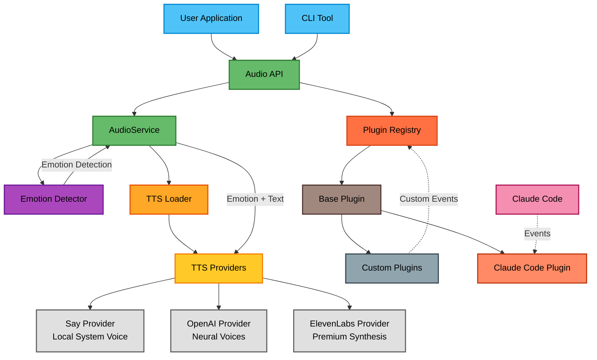

# @eh-aye/stts - Smart Text-to-Speech with Emotions 🔊

[](https://www.npmjs.com/package/@eh-aye/stts)
[](https://opensource.org/licenses/MIT)
[](https://nodejs.org)

A powerful text-to-speech library with 15 different emotions, multiple provider support, and a flexible plugin system.

## Features

- 🎭 **15 Emotions** - From cheerful to melancholic, angry to empathetic
- 🔊 **Multiple TTS Providers** - OpenAI, ElevenLabs, and system voices
- 🔌 **Plugin System** - Extend functionality with custom plugins
- 🤖 **Claude Code Integration** - Optional voice notifications for Claude Code
- 🎯 **Simple API** - Just `speak("Hello")` to get started

📊 **[View Architecture Diagram](./docs/ARCHITECTURE-FLOW.md)** - See how all the components work together

## When Your Code Finds Its Voice 🗣️💻

<p align="center">
  
</p>

## Quick Start

### Installation

```bash
npm install @eh-aye/stts
```

### Basic Usage

```typescript
import { speak } from '@eh-aye/stts';

// Simple speech
await speak('Hello, world!');

// With emotion
await speak('Great job!', { emotion: 'cheerful' });

// Auto-detect emotion
await speak('Oh no, something went wrong!', { autoDetectEmotion: true });
```

## Available Emotions

- `cheerful` - Happy and enthusiastic
- `neutral` - Calm and professional
- `concerned` - Thoughtful and worried
- `urgent` - Attention-grabbing
- `disappointed` - Sad but understanding
- `excited` - Very energetic
- `sarcastic` - Ironic and witty
- `calm` - Peaceful and composed
- `angry` - Frustrated and intense
- `empathetic` - Understanding and compassionate
- `confused` - Puzzled and uncertain
- `hopeful` - Optimistic and positive
- `fearful` - Anxious and worried
- `melancholic` - Sad and reflective
- `curious` - Interested and inquisitive

## API

### Core Functions

```typescript
// Speak with options
speak(text: string, options?: {
  emotion?: Emotion,
  provider?: string,
  autoDetectEmotion?: boolean
}): Promise<boolean>

// Speak with context-based emotion
speakWithEmotion(text: string, context?: {
  success?: boolean,
  error?: boolean
}): Promise<boolean>

// Create custom audio service
createAudioService(config?: TTSConfig): AudioService

// Get available providers
getAvailableProviders(): Promise<string[]>
```

## TTS Providers

### Local System Voice (Default)

Works out of the box on macOS, Windows, and Linux.

### OpenAI TTS

High-quality neural voices. Set your API key:

```bash
# Preferred (avoids conflicts with other tools)
export STTS_OPENAI_API_KEY="your-key-here"

# Or use the fallback
export OPENAI_API_KEY="your-key-here"
```

### ElevenLabs

Premium voice synthesis with advanced emotion control:

```bash
# Preferred (avoids conflicts with other tools)
export STTS_ELEVENLABS_API_KEY="your-key-here"

# Or use the fallback
export ELEVENLABS_API_KEY="your-key-here"
```

## Plugin System

Create custom plugins to extend functionality:

```typescript
import { BasePlugin, getRegistry } from '@eh-aye/stts';

class MyPlugin extends BasePlugin {
  name = 'my-plugin';

  async handleEvent(event) {
    if (event.type === 'custom-event') {
      await this.audio.speak('Custom event received!');
    }
  }
}

// Register plugin
const registry = getRegistry();
await registry.register(new MyPlugin());
```

## Claude Code Integration (Optional)

If you're using Claude Code, you can enable voice notifications:

```bash
# Install STTS globally
npm install -g @eh-aye/stts

# Enable Claude Code integration
stts enable claude-code

# Enable with dangerous command blocking (optional)
stts enable claude-code --dangerous-commands

# Enable without audio (silent mode)
stts enable claude-code --no-audio

# Test it works
stts test
```

### Configuration

STTS can be configured via:

- Configuration files: `~/.stts.json` (global) and `./.stts.json` (project-specific)
- Environment variables (override config files)
- CLI commands

#### Configuration Options

```json
{
  "audioEnabled": true,
  "enableDangerousCommandBlocking": false,
  "customDangerousCommands": []
}
```

#### Managing Configuration

```bash
# Show current configuration
stts config --show

# Enable/disable dangerous command blocking
stts config --enable-dangerous-commands
stts config --disable-dangerous-commands

# Enable/disable audio
stts config --enable-audio
stts config --disable-audio

# Add custom dangerous command patterns
stts config --add-dangerous-command "sudo rm"
stts config --add-dangerous-command "DROP TABLE"

# Backup and restore settings
stts status --backups      # List available backups
stts restore               # Restore from backup (interactive)
stts restore 1             # Restore backup #1 directly
```

Configuration is loaded in this order (later sources override earlier ones):

1. Global config: `~/.stts.json`
2. Project config: `./.stts.json` (in current directory)
3. Environment variables

#### Environment Variables

```bash
# Configuration
export STTS_ENABLE_DANGEROUS_COMMAND_BLOCKING=true
export STTS_AUDIO_ENABLED=false
export STTS_CUSTOM_DANGEROUS_COMMANDS="sudo rm,DROP TABLE,DELETE FROM"

# Claude settings path (default: ~/.claude/settings.json)
export STTS_CLAUDE_SETTINGS_PATH="/custom/path/to/settings.json"
```

### Dangerous Command Blocking

When enabled, STTS will block potentially destructive commands:

- File system: `rm -rf`, `dd if=`, `mkfs`, `format`
- System: `chmod -R 777 /`, `chown -R`, `:(){:|:&};:`
- Git: `git push --force`, `git reset --hard`, `git clean -fdx`
- Custom patterns you define

To enable:

```bash
stts config --enable-dangerous-commands
```

This adds voice notifications for:

- Task completions
- Long-running commands
- Error notifications
- Session end alerts

## Configuration

Configure via environment variables:

```bash
# Provider priority
export STTS_PRIORITY="openai,elevenlabs,say"

# Voice settings
export STTS_VOICE_TYPE="female"

# API Keys (use STTS_ prefix to avoid conflicts)
export STTS_OPENAI_API_KEY="sk-..."
export STTS_ELEVENLABS_API_KEY="..."

# Claude integration settings
export STTS_CLAUDE_SETTINGS_PATH="/path/to/claude/settings.json"
```

## Architecture



## 📊 Lines of Code

| Language    | Files   | Lines    | Code     | Comments | Blanks   |
| ----------- | ------- | -------- | -------- | -------- | -------- |
| Environment | 2       | 21       | 4        | 14       | 3        |
| Git         | 1       | 55       | 28       | 16       | 11       |
| JSON        | 12      | 583      | 85       | 475      | 23       |
| JavaScript  | 2       | 111      | 84       | 9        | 18       |
| License     | 1       | 21       | 17       | 0        | 4        |
| Markdown    | 16      | 1987     | 1105     | 343      | 539      |
| Shell       | 2       | 69       | 47       | 11       | 11       |
| TypeScript  | 69      | 6103     | 4728     | 420      | 955      |
| YAML        | 5       | 216      | 180      | 4        | 32       |
| **Total**   | **110** | **9166** | **6278** | **1292** | **1596** |

_Last updated: 2025-07-09_

## Examples

See the [examples](./examples) directory for:

- Basic usage
- Custom audio services
- Plugin development
- Emotion detection

## Documentation

For detailed documentation, see the [docs directory](./docs):

- 📚 [Technical Documentation](./docs/TECH.md) - Architecture and implementation details
- 🏗️ [Architecture Flow](./docs/ARCHITECTURE-FLOW.md) - Detailed component relationships
- 🔧 [Development Guide](./docs/DEVELOPMENT.md) - Setup and contribution guide
- 🧪 [Testing Guide](./docs/TESTING.md) - Testing TTS functionality
- 📋 [TODO/Roadmap](./docs/TODO.md) - Future enhancements and ideas

## Development

```bash
# Install dependencies
npm install

# Run tests
npm test

# Build
npm run build

# Lint
npm run lint
```

## License

MIT © 2025 Val Neekman, Neekware Inc.

## Contributing

Contributions welcome! Please read our [contributing guidelines](./CONTRIBUTING.md) first.

## Support

- 🐛 [Report bugs](https://github.com/anthropics/claude-code/issues)
- 💡 [Request features](https://github.com/anthropics/claude-code/issues)
- 📖 [Read the docs](./docs)

## Sponsors

- [Neekware Inc.](https://neekware.com)
