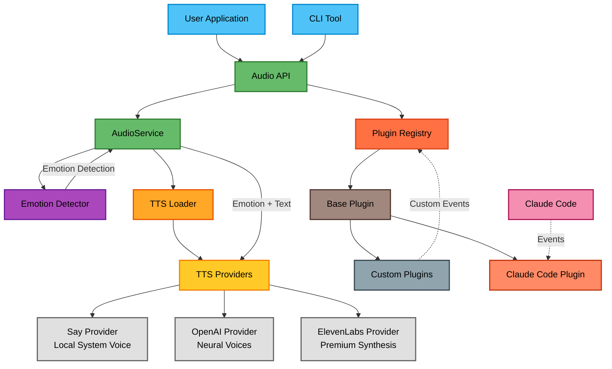

# @eh-aye/stts - Smart Text-to-Speech with Emotions 🔊

[](https://www.npmjs.com/package/@eh-aye/stts)
[](https://opensource.org/licenses/MIT)
[](https://nodejs.org)

A powerful text-to-speech library with 15 different emotions, multiple provider support, and a flexible plugin system.

## Features

- 🎭 **15 Emotions** - From cheerful to melancholic, angry to empathetic
- 🔊 **Multiple TTS Providers** - OpenAI, ElevenLabs, and system voices
- 🔌 **Plugin System** - Extend functionality with custom plugins
- 🤖 **Claude Code Integration** - Optional voice notifications for Claude Code
- 🧠 **LLM-Powered Feedback** - Dynamic, context-aware messages using Claude CLI
- 🎯 **Simple API** - Just `speak("Hello")` to get started

📊 **[View Architecture Diagram](./docs/ARCHITECTURE-FLOW.md)** - See how all the components work together

## When Your Code Finds Its Voice 🗣️💻

<p align="center">
  
</p>

## Quick Start

### Installation

```bash
npm install @eh-aye/stts
```

### Basic Usage

```typescript
import { speak } from '@eh-aye/stts';

// Simple speech
await speak('Hello, world!');

// With emotion
await speak('Great job!', { emotion: 'cheerful' });

// Auto-detect emotion
await speak('Oh no, something went wrong!', { autoDetectEmotion: true });
```

## Available Emotions

- `cheerful` - Happy and enthusiastic
- `neutral` - Calm and professional
- `concerned` - Thoughtful and worried
- `urgent` - Attention-grabbing
- `disappointed` - Sad but understanding
- `excited` - Very energetic
- `sarcastic` - Ironic and witty
- `calm` - Peaceful and composed
- `angry` - Frustrated and intense
- `empathetic` - Understanding and compassionate
- `confused` - Puzzled and uncertain
- `hopeful` - Optimistic and positive
- `fearful` - Anxious and worried
- `melancholic` - Sad and reflective
- `curious` - Interested and inquisitive

## API

### Core Functions

```typescript
// Speak with options
speak(text: string, options?: {
  emotion?: Emotion,
  provider?: string,
  autoDetectEmotion?: boolean
}): Promise<boolean>

// Speak with context-based emotion
speakWithEmotion(text: string, context?: {
  success?: boolean,
  error?: boolean
}): Promise<boolean>

// Create custom audio service
createAudioService(config?: TTSConfig): AudioService

// Get available providers
getAvailableProviders(): Promise<string[]>
```

## TTS Providers

### Local System Voice (Default)

Works out of the box on macOS, Windows, and Linux.

### OpenAI TTS

High-quality neural voices. Set your API key:

```bash
# Preferred (avoids conflicts with other tools)
export STTS_OPENAI_API_KEY="your-key-here"

# Or use the fallback
export OPENAI_API_KEY="your-key-here"
```

### ElevenLabs

Premium voice synthesis with advanced emotion control:

```bash
# Preferred (avoids conflicts with other tools)
export STTS_ELEVENLABS_API_KEY="your-key-here"

# Or use the fallback
export ELEVENLABS_API_KEY="your-key-here"
```

## Plugin System

Create custom plugins to extend functionality:

```typescript
import { BasePlugin, getRegistry } from '@eh-aye/stts';

class MyPlugin extends BasePlugin {
  name = 'my-plugin';

  async handleEvent(event) {
    if (event.type === 'custom-event') {
      await this.audio.speak('Custom event received!');
    }
  }
}

// Register plugin
const registry = getRegistry();
await registry.register(new MyPlugin());
```

## Claude Code Integration (Optional)

If you're using Claude Code, you can enable voice notifications:

```bash
# Install STTS globally
npm install -g @eh-aye/stts

# Enable Claude Code integration (standard)
stts enable claude-code

# Enable with dangerous command blocking (optional)
stts enable claude-code --dangerous-commands

# Enable without audio (silent mode)
stts enable claude-code --no-audio

# Install wrapper scripts (advanced)
stts enable claude-code --user       # User-level wrapper in ~/.stts/hooks/ (warns if stts missing)
stts enable claude-code --workspace  # Workspace-level wrapper in .claude/hooks/ (silent if stts missing)

# Note: Currently only claude-code and claude are supported
# Future versions will add support for cursor, vscode, windsurf, zed

# Test it works
stts test
```

### Wrapper Scripts

STTS can install wrapper scripts to handle situations where Claude Code might overwrite your settings:

- **User-level wrapper** (`--user`): Installs to `~/.stts/hooks/stts` and warns if stts command is not available
- **Workspace-level wrapper** (`--workspace`): Installs to `.claude/hooks/stts` and silently continues if stts is not available

```bash
# Remove wrapper scripts
stts disable claude-code --user       # Remove user-level wrapper
stts disable claude-code --workspace  # Remove workspace-level wrapper
```

### Configuration

STTS can be configured via:

- Configuration files: `~/.stts.json` (user-level) and `./.stts.json` (workspace-specific)
- Environment variables (override config files)
- CLI commands

#### Configuration Options

```json
{
  "audioEnabled": true,
  "enableDangerousCommandBlocking": false,
  "customDangerousCommands": []
}
```

#### CLI Commands Reference

##### `stts detect`

Detect installed development tools.

```bash
stts detect               # Detect all installed tools
stts detect claude        # Check if Claude Code is installed
stts detect --json        # Output results as JSON
```

Supported tools: `claude`, `claude-code`, `cursor`, `windsurf`, `zed`

##### `stts enable`

Enable TTS hooks for a development tool.

```bash
stts enable claude-code                # Enable with user-level wrapper (default)
stts enable claude-code --workspace    # Enable with workspace-level wrapper
stts enable claude-code --no-audio     # Enable without audio announcements
stts enable claude-code --dangerous-commands  # Enable with dangerous command blocking
```

##### `stts disable`

Disable TTS hooks for a development tool.

```bash
stts disable claude-code             # Remove hooks and user wrapper
stts disable claude-code --workspace # Remove hooks and workspace wrapper
```

##### `stts status`

Show TTS status for all tools.

```bash
stts status               # Show TTS status for all tools
stts status --backups     # List available settings backups
stts status --json        # Output status in JSON format
```

##### `stts config`

Manage STTS configuration.

```bash
# Show configuration
stts config show

# Audio settings
stts config audio --enable
stts config audio --disable

# Debug mode
stts config debug --enable   # Enable debug logging
stts config debug --disable  # Disable debug logging

# Dangerous command blocking
stts config dangerous-commands --enable
stts config dangerous-commands --disable
stts config dangerous-commands --add "sudo rm -rf"

# LLM settings
stts config llm --enable
stts config llm --disable
stts config llm --style casual      # Options: casual, professional, encouraging
stts config llm --max-words 10      # Limit response length
stts config llm --model claude-3-5-sonnet-20241022

# Generic configuration
stts config set <key> <value>        # Set any configuration value
```

##### `stts test`

Test TTS functionality.

```bash
stts test                           # Test with default message
stts test -m "Hello world"         # Test with custom message
stts test --list-providers          # List available TTS providers
```

##### `stts restore`

Restore settings from a backup.

```bash
stts restore claude-code            # Interactive restore selection
stts restore claude-code 2          # Restore backup #2
stts restore claude-code 1 --force  # Restore without confirmation
```

##### `stts llm`

Manage LLM feedback and caching.

```bash
# Test LLM feedback
stts llm test -s                    # Run test scenarios
stts llm test -p "Testing prompt"  # Test with custom prompt
stts llm test -c '{"eventType":"stop"}'  # Test with JSON context

# Manage cache
stts llm cache show                 # Show cache statistics
stts llm cache clear                # Clear all cache entries
stts llm cache tail                 # Monitor cache in real-time
stts llm cache export               # Export cache to JSON

# Enable/disable
stts llm enable                     # Enable LLM feedback
stts llm disable                    # Disable LLM feedback
stts llm status                     # Show LLM configuration
```

##### `stts hook` (Internal Use)

Execute TTS hooks - called automatically by Claude.

```bash
stts hook <type>                    # Internal use only
```

Supported hook types: `pre-tool-use`, `post-tool-use`, `notification`, `stop`, `subagent-stop`

Configuration is loaded in this order (later sources override earlier ones):

1. User config: `~/.stts.json`
2. Workspace config: `./.stts.json` (in current directory)
3. Environment variables

#### Environment Variables

```bash
# Configuration
export STTS_ENABLE_DANGEROUS_COMMAND_BLOCKING=true
export STTS_AUDIO_ENABLED=false
export STTS_CUSTOM_DANGEROUS_COMMANDS="sudo rm,DROP TABLE,DELETE FROM"

# Claude settings path (default: ~/.claude/settings.json)
export STTS_CLAUDE_SETTINGS_PATH="/custom/path/to/settings.json"
```

### Dangerous Command Blocking

When enabled, STTS will block potentially destructive commands:

- File system: `rm -rf`, `dd if=`, `mkfs`, `format`
- System: `chmod -R 777 /`, `chown -R`, `:(){:|:&};:`
- Git: `git push --force`, `git reset --hard`, `git clean -fdx`
- Custom patterns you define

To enable:

```bash
stts config --enable-dangerous-commands
```

This adds voice notifications for:

- Task completions
- Long-running commands
- Error notifications
- Session end alerts

## Configuration

Configure via environment variables:

```bash
# Provider priority
export STTS_PRIORITY="openai,elevenlabs,say"

# Voice settings
export STTS_VOICE_TYPE="female"

# API Keys (use STTS_ prefix to avoid conflicts)
export STTS_OPENAI_API_KEY="sk-..."
export STTS_ELEVENLABS_API_KEY="..."

# Claude integration settings
export STTS_CLAUDE_SETTINGS_PATH="/path/to/claude/settings.json"
```

### LLM-Powered Feedback (Claude Code Integration)

STTS can generate dynamic, context-aware messages using Claude CLI instead of static notifications:

```bash
# Enable/disable LLM feedback
stts llm enable              # Enable LLM-powered feedback
stts llm disable             # Disable LLM feedback
stts llm status              # Show current LLM configuration

# Configure LLM settings
stts config llm --style casual      # Options: casual, professional, encouraging
stts config llm --max-words 10      # Limit response length
stts config llm --model claude-3-5-sonnet-20241022  # Claude model to use

# Or use the generic config command
stts config set llmEnabled true
stts config set llmStyle casual
stts config set llmMaxWords 8

# Manage LLM response cache
stts llm cache show          # View cache statistics and entries
stts llm cache clear         # Clear all cached responses
stts llm cache export        # Export cache to JSON file
```

**Features:**

- **Context-aware messages**: Generates feedback based on command type, duration, and outcome
- **Session summaries**: Provides intelligent summaries when sessions end
- **Automatic fallbacks**: Uses static messages when Claude CLI is unavailable
- **Response caching**: Caches similar responses to minimize LLM calls
- **Zero configuration**: Works out-of-the-box with Claude Code

**Examples:**

- Build success: "Nice! Build crushed it" instead of "Build completed in 45 seconds"
- Test failure: "Tests need some love" instead of "Test failed with error"
- Long task: "Finally done, great patience" instead of "Command completed in 120 seconds"
- Session end: "Productive session, nice work" instead of "Session completed"

## Architecture



## 📊 Lines of Code

| Language    | Files   | Lines     | Code      | Comments | Blanks   |
| ----------- | ------- | --------- | --------- | -------- | -------- |
| Environment | 2       | 21        | 4         | 14       | 3        |
| Git         | 2       | 59        | 30        | 17       | 12       |
| JSON        | 145     | 773       | 243       | 507      | 23       |
| JavaScript  | 2       | 111       | 84        | 9        | 18       |
| License     | 1       | 21        | 17        | 0        | 4        |
| Markdown    | 20      | 3371      | 1928      | 513      | 930      |
| Shell       | 12      | 697       | 431       | 126      | 140      |
| TypeScript  | 77      | 9772      | 7597      | 662      | 1513     |
| YAML        | 5       | 216       | 180       | 4        | 32       |
| **Total**   | **266** | **15041** | **10514** | **1852** | **2675** |

_Last updated: 2025-07-11_

## Examples

See the [examples](./examples) directory for:

- Basic usage
- Custom audio services
- Plugin development
- Emotion detection

## Documentation

For detailed documentation, see the [docs directory](./docs):

- 📚 [Technical Documentation](./docs/TECH.md) - Architecture and implementation details
- 🏗️ [Architecture Flow](./docs/ARCHITECTURE-FLOW.md) - Detailed component relationships
- 🔧 [Development Guide](./docs/DEVELOPMENT.md) - Setup and contribution guide
- 🧪 [Testing Guide](./docs/TESTING.md) - Testing TTS functionality
- 🤖 [LLM Debugging Guide](./docs/LLM-DEBUGGING.md) - Debug and monitor LLM integration
- 📋 [TODO/Roadmap](./docs/TODO.md) - Future enhancements and ideas

## Development

```bash
# Install dependencies
npm install

# Run tests
npm test

# Build
npm run build

# Lint
npm run lint
```

## License

MIT © 2025 Val Neekman, Neekware Inc.

## Contributing

Contributions welcome! Please read our [contributing guidelines](./CONTRIBUTING.md) first.

## Support

- 🐛 [Report bugs](https://github.com/anthropics/claude-code/issues)
- 💡 [Request features](https://github.com/anthropics/claude-code/issues)
- 📖 [Read the docs](./docs)

## Sponsors

- [Neekware Inc.](https://neekware.com)
