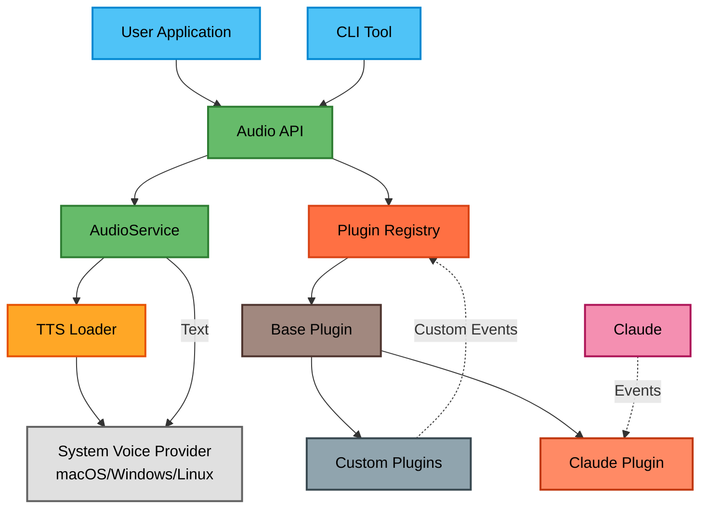

# @eh-aye/stts - Simple Text-to-Speech 🔊

[](https://www.npmjs.com/package/@eh-aye/stts)
[](https://opensource.org/licenses/MIT)
[](https://nodejs.org)

A simple text-to-speech library using system voice with a flexible plugin system.

## Features

- 🔊 **System Voice** - Uses your system's built-in text-to-speech
- 🔌 **Plugin System** - Extend functionality with custom plugins
- 🤖 **Claude Code Integration** - Optional voice notifications for Claude Code (Claude)
- 🎯 **Simple API** - Just `speak("Hello")` to get started

## When Your Code Finds Its Voice 🗣️💻

<p align="center">
  
</p>

## Quick Start

### Installation

```bash
npm install @eh-aye/stts
```

### Basic Usage

```typescript
import { speak } from '@eh-aye/stts';

// Simple speech
await speak('Hello, world!');
```

## API

### Core Functions

```typescript
// Speak text
speak(text: string): Promise<boolean>

// Speak with context
speakWithEmotion(text: string, context?: {
  success?: boolean,
  error?: boolean
}): Promise<boolean>

// Create custom audio service
createAudioService(config?: TTSConfig): AudioService

// Get available providers (returns ['system'])
getAvailableProviders(): Promise<string[]>
```

## TTS System

STTS uses your system's built-in text-to-speech voice. On macOS, this uses the `say` command with the system's default voice.

## Plugin System

Create custom plugins to extend functionality:

```typescript
import { BasePlugin, getRegistry } from '@eh-aye/stts';

class MyPlugin extends BasePlugin {
  name = 'my-plugin';

  async handleEvent(event) {
    if (event.type === 'custom-event') {
      await this.audio.speak('Custom event received!');
    }
  }
}

// Register plugin
const registry = getRegistry();
await registry.register(new MyPlugin());
```

## Claude Integration (Optional)

If you're using Claude Code (referred to as "Claude" throughout this documentation), you can enable voice notifications:

```bash
# Install STTS globally
npm install -g @eh-aye/stts

# Enable Claude integration
stts claude enable

# After enabling, you can use these commands in Claude:
audio enable    # Enable audio notifications
audio disable   # Disable audio notifications

# Test it works
stts test

# Or from within Claude:
audio enable   # Enable audio notifications
audio disable  # Disable audio notifications
```

### How It Works

STTS installs three components:

1. **Global wrapper** at `~/.stts/hooks/stts` - Handles the actual TTS execution
2. **Local settings** in `.claude/settings.local.json` - Your personal hooks configuration (not tracked by git)
3. **Audio command** at `~/.claude/commands/audio` - Quick enable/disable from within Claude

This setup ensures:

- Your TTS preferences don't affect other team members
- You can quickly toggle audio on/off without leaving Claude
- The wrapper is available globally for all your projects

```bash
# Disable Claude integration
stts claude disable
```

### Configuration

STTS can be configured via:

- Configuration files: `~/.stts.json` (user-level) and `./.stts.json` (workspace-specific)
- Environment variables (override config files)

#### Configuration Options

```json
{
  "audioEnabled": true
}
```

#### CLI Commands Reference

##### `stts claude`

Manage TTS for Claude tools.

```bash
stts claude enable                     # Enable TTS hooks for Claude
stts claude disable                    # Disable TTS hooks for Claude
stts claude status                     # Check TTS status for Claude
```

##### `stts test`

Test TTS functionality.

```bash
stts test                           # Test with default message
stts test -m "Hello world"         # Test with custom message
stts test --list-providers          # List available TTS providers
```

##### `stts hook` (Internal Use)

Execute TTS hooks - called automatically by Claude.

```bash
stts hook <type>                    # Internal use only
```

Supported hook types: `pre-tool-use`, `post-tool-use`, `notification`, `stop`, `subagent-stop`

Configuration is loaded in this order (later sources override earlier ones):

1. User config: `~/.stts.json`
2. Workspace config: `./.stts.json` (in current directory)
3. Environment variables

#### Environment Variables

```bash
# Audio enabled (default: true)
export STTS_AUDIO_ENABLED=false

# Claude settings path (default: ~/.claude/settings.json)
export STTS_CLAUDE_SETTINGS_PATH="/custom/path/to/settings.json"
```

## Configuration

Configure via environment variables:

```bash
# Claude integration settings
export STTS_CLAUDE_SETTINGS_PATH="/path/to/claude/settings.json"
```

## Architecture



## 📊 Lines of Code

| Language    | Files   | Lines     | Code     | Comments | Blanks   |
| ----------- | ------- | --------- | -------- | -------- | -------- |
| Batch       | 1       | 20        | 12       | 7        | 1        |
| Environment | 1       | 18        | 2        | 13       | 3        |
| Git         | 2       | 72        | 36       | 20       | 16       |
| JSON        | 146     | 792       | 247      | 521      | 24       |
| JavaScript  | 10      | 3719      | 2692     | 416      | 611      |
| License     | 1       | 21        | 17       | 0        | 4        |
| Markdown    | 11      | 926       | 490      | 147      | 289      |
| Shell       | 6       | 318       | 190      | 69       | 59       |
| TypeScript  | 61      | 6039      | 4522     | 509      | 1008     |
| YAML        | 5       | 216       | 180      | 4        | 32       |
| **Total**   | **244** | **12141** | **8388** | **1706** | **2047** |

_Last updated: 2025-07-12_

## Examples

See the [examples](./examples) directory for:

- Basic usage
- Custom audio services
- Plugin development

## Development

```bash
# Install dependencies
npm install

# Run tests
npm test

# Build
npm run build

# Lint
npm run lint
```

## License

MIT © 2025 Val Neekman, Neekware Inc.

## Contributing

Contributions welcome! Please read our [contributing guidelines](./CONTRIBUTING.md) first.

## Support

- 🐛 [Report bugs](https://github.com/neekware/eh-aye-stts/issues)
- 💡 [Request features](https://github.com/neekware/eh-aye-stts/issues)
- 📖 [Read the docs](./docs)

## Sponsors

- [Neekware Inc.](https://neekware.com)
