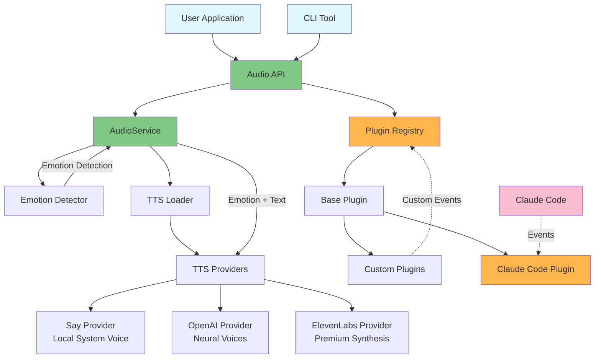

# @eh-aye/stts - Smart Text-to-Speech with Emotions 🔊

[](https://www.npmjs.com/package/@eh-aye/stts)
[](https://opensource.org/licenses/MIT)
[](https://nodejs.org)

A powerful text-to-speech library with 15 different emotions, multiple provider support, and a flexible plugin system.

## Features

- 🎭 **15 Emotions** - From cheerful to melancholic, angry to empathetic
- 🔊 **Multiple TTS Providers** - OpenAI, ElevenLabs, and system voices
- 🔌 **Plugin System** - Extend functionality with custom plugins
- 🤖 **Claude Code Integration** - Optional voice notifications for Claude Code
- 🎯 **Simple API** - Just `speak("Hello")` to get started

## When Your Code Finds Its Voice 🗣️💻

<p align="center">
  
</p>

## Quick Start

### Installation

```bash
npm install @eh-aye/stts
```

### Basic Usage

```typescript
import { speak } from '@eh-aye/stts';

// Simple speech
await speak('Hello, world!');

// With emotion
await speak('Great job!', { emotion: 'cheerful' });

// Auto-detect emotion
await speak('Oh no, something went wrong!', { autoDetectEmotion: true });
```

## Available Emotions

- `cheerful` - Happy and enthusiastic
- `neutral` - Calm and professional
- `concerned` - Thoughtful and worried
- `urgent` - Attention-grabbing
- `disappointed` - Sad but understanding
- `excited` - Very energetic
- `sarcastic` - Ironic and witty
- `calm` - Peaceful and composed
- `angry` - Frustrated and intense
- `empathetic` - Understanding and compassionate
- `confused` - Puzzled and uncertain
- `hopeful` - Optimistic and positive
- `fearful` - Anxious and worried
- `melancholic` - Sad and reflective
- `curious` - Interested and inquisitive

## API

### Core Functions

```typescript
// Speak with options
speak(text: string, options?: {
  emotion?: Emotion,
  provider?: string,
  autoDetectEmotion?: boolean
}): Promise<boolean>

// Speak with context-based emotion
speakWithEmotion(text: string, context?: {
  success?: boolean,
  error?: boolean
}): Promise<boolean>

// Create custom audio service
createAudioService(config?: TTSConfig): AudioService

// Get available providers
getAvailableProviders(): Promise<string[]>
```

## TTS Providers

### Local System Voice (Default)

Works out of the box on macOS, Windows, and Linux.

### OpenAI TTS

High-quality neural voices. Set your API key:

```bash
export OPENAI_API_KEY="your-key-here"
```

### ElevenLabs

Premium voice synthesis with advanced emotion control:

```bash
export ELEVENLABS_API_KEY="your-key-here"
```

## Plugin System

Create custom plugins to extend functionality:

```typescript
import { BasePlugin, getRegistry } from '@eh-aye/stts';

class MyPlugin extends BasePlugin {
  name = 'my-plugin';

  async handleEvent(event) {
    if (event.type === 'custom-event') {
      await this.audio.speak('Custom event received!');
    }
  }
}

// Register plugin
const registry = getRegistry();
await registry.register(new MyPlugin());
```

## Claude Code Integration (Optional)

If you're using Claude Code, you can enable voice notifications:

```bash
# Install STTS globally
npm install -g @eh-aye/stts

# Enable Claude Code integration
stts enable claude-code

# Test it works
stts test
```

This adds voice notifications for:

- Task completions
- Long-running commands
- Error notifications
- Session end alerts

## Configuration

Configure via environment variables:

```bash
# Provider priority
export TTS_PRIORITY="openai,elevenlabs,say"

# Voice settings
export TTS_VOICE_GENDER="female"
export TTS_DEFAULT_EMOTION="calm"

# API Keys
export OPENAI_API_KEY="sk-..."
export ELEVENLABS_API_KEY="..."
```

## Architecture



## Examples

See the [examples](./examples) directory for:

- Basic usage
- Custom audio services
- Plugin development
- Emotion detection

## Documentation

For detailed documentation, see the [docs directory](./docs):

- 📚 [Technical Documentation](./docs/TECH.md) - Architecture and implementation details
- 🏗️ [Architecture Flow](./docs/architecture-flow.md) - Detailed component relationships
- 🔧 [Development Guide](./docs/DEVELOPMENT.md) - Setup and contribution guide
- 🧪 [Testing Guide](./docs/TESTING.md) - Testing TTS functionality
- 📋 [TODO/Roadmap](./docs/TODO.md) - Future enhancements and ideas

## Development

```bash
# Install dependencies
npm install

# Run tests
npm test

# Build
npm run build

# Lint
npm run lint
```

## License

MIT © Val Karpov

## Contributing

Contributions welcome! Please read our [contributing guidelines](./CONTRIBUTING.md) first.

## Support

- 🐛 [Report bugs](https://github.com/anthropics/claude-code/issues)
- 💡 [Request features](https://github.com/anthropics/claude-code/issues)
- 📖 [Read the docs](./docs)
