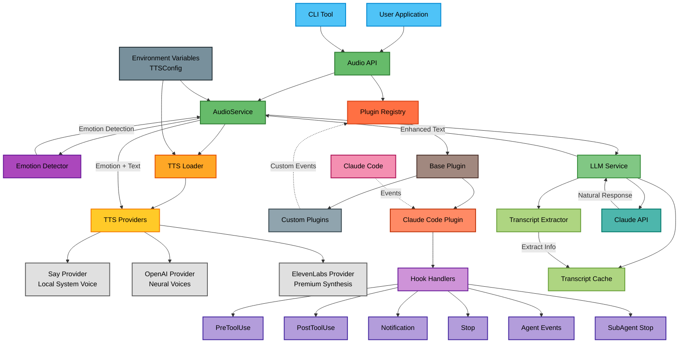

# STTS Architecture Flow

## Component Descriptions

### Core Components

1. **Audio API** - Main entry point providing `speak()`, `speakWithEmotion()` functions
2. **AudioService** - Manages TTS providers, emotion handling, and LLM integration
3. **Emotion Detector** - Analyzes text/context to determine appropriate emotion
4. **TTS Loader** - Loads and manages available TTS providers
5. **LLM Service** - Provides natural language processing and enhanced feedback generation

### TTS Providers

- **Say Provider** - Local system voice (macOS/Windows/Linux)
- **OpenAI Provider** - High-quality neural voices
- **ElevenLabs Provider** - Premium voice synthesis with advanced emotion control

### Plugin System

1. **Plugin Registry** - Manages plugin lifecycle and event broadcasting
2. **Base Plugin** - Abstract base class for all plugins
3. **Claude Code Plugin** - Handles Claude Code specific events
4. **Custom Plugins** - User-defined plugins for extending functionality

### LLM Integration

1. **LLM Service** - Manages Claude API integration for natural language responses
2. **Transcript Cache** - Caches Claude Code transcripts for context
3. **Transcript Extractor** - Extracts relevant information from transcripts
4. **Claude API** - Generates natural, contextual responses

### Event Flow

1. Events flow from external sources (Claude Code, custom apps) to plugins
2. Plugins process events and trigger appropriate audio responses
3. For LLM-enabled events, responses are enhanced through Claude API
4. Audio responses are routed through the emotion system to TTS providers
