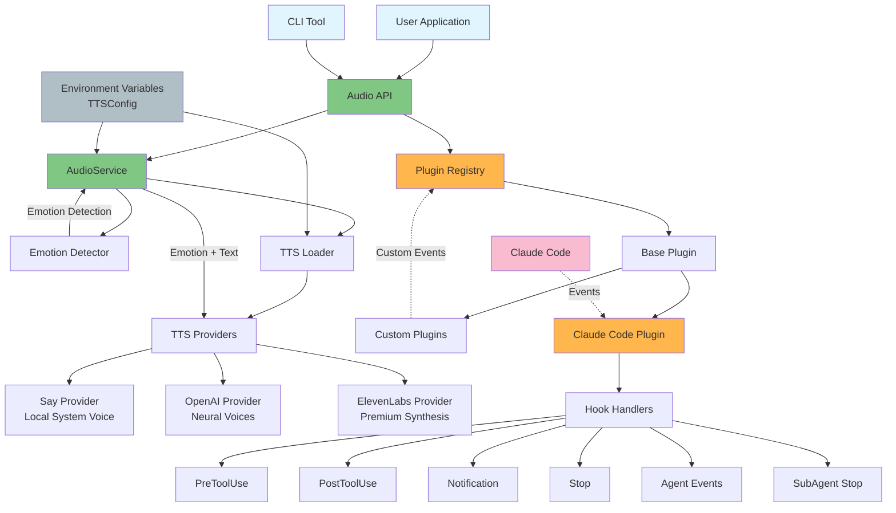

# STTS Architecture Flow

## Component Descriptions

### Core Components

1. **Audio API** - Main entry point providing `speak()`, `speakWithEmotion()` functions
2. **AudioService** - Manages TTS providers and emotion handling
3. **Emotion Detector** - Analyzes text/context to determine appropriate emotion
4. **TTS Loader** - Loads and manages available TTS providers

### TTS Providers

- **Say Provider** - Local system voice (macOS/Windows/Linux)
- **OpenAI Provider** - High-quality neural voices
- **ElevenLabs Provider** - Premium voice synthesis with advanced emotion control

### Plugin System

1. **Plugin Registry** - Manages plugin lifecycle and event broadcasting
2. **Base Plugin** - Abstract base class for all plugins
3. **Claude Code Plugin** - Handles Claude Code specific events
4. **Custom Plugins** - User-defined plugins for extending functionality

### Event Flow

1. Events flow from external sources (Claude Code, custom apps) to plugins
2. Plugins process events and trigger appropriate audio responses
3. Audio responses are routed through the emotion system to TTS providers
